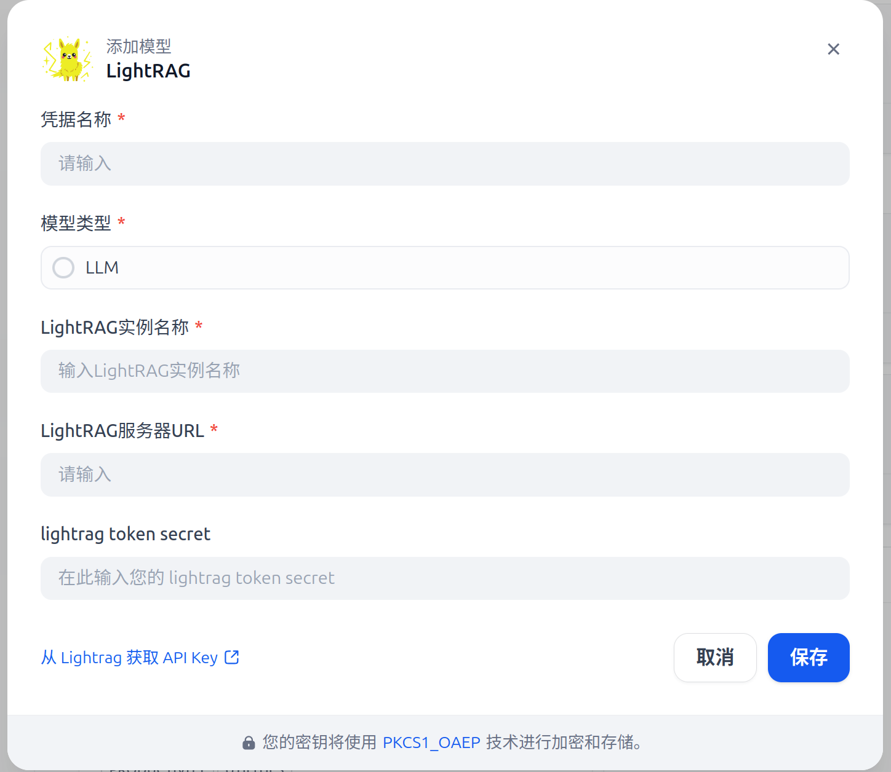
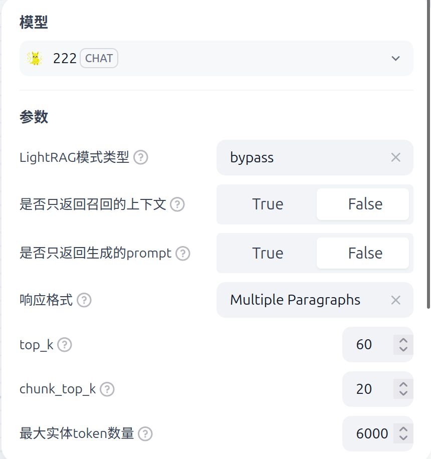

## lightrag

**Author:** dadastory  
**Version:** 0.0.1  
**Type:** model  

### Description

- This is a LLM plugin for LightRAG.  
- It allows LightRAG to be mounted as a large language model (LLM) in Dify, enabling easy integration and usage.  
- LightRAG server deployment can follow instructions from the official LightRAG documentation.

### Features

- Seamless integration of LightRAG as a Dify LLM plugin.  
- Support for standard LLM requests and streaming responses.  
- Easy configuration through Dify plugin system.

### Limitations

- **Token calculation is currently not supported.**  
- Ensure the LightRAG server is running and accessible before using the plugin.  

### Installation

1. Clone or download this plugin into your Dify plugins directory.  
2. Configure the plugin according to your LightRAG server address and credentials.  
3. Restart Dify to load the plugin.  
4. Install and startup lightrag refer official document [https://github.com/HKUDS/LightRAG]

### Usage

- Once installed, you can select `lightrag` as a model in Dify LLM settings.  
- Send prompts normally; the plugin will forward requests to the LightRAG server.  
- You can change the mode configure for request lightrag

### Configuration

- `server_url`: The HTTP endpoint of the running LightRAG server (e.g., `http://localhost:9621`).  
- `api_key` or other credentials as required by LightRAG.  （However, lightrag cannot support this params, so it won't work currently)