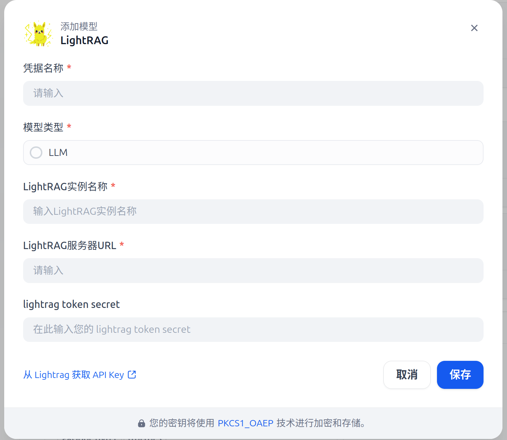
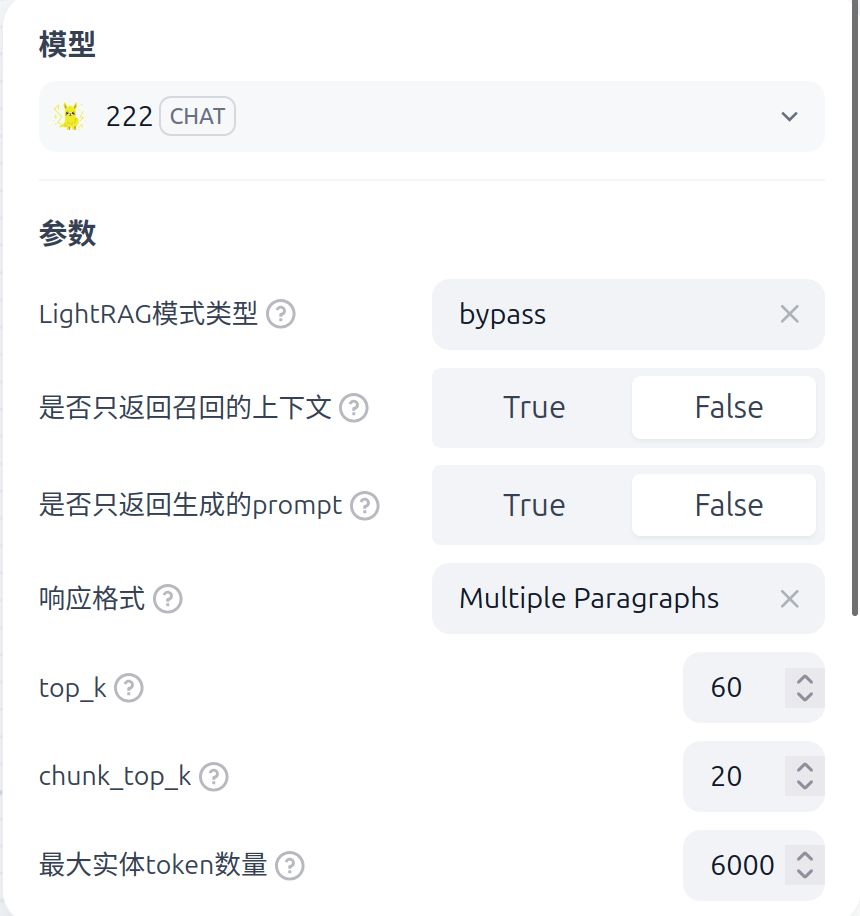

# lightrag

**Author:** dadastory  
**Type:** model

## Description

- This is a LLM plugin for LightRAG.
- It allows LightRAG to be mounted as a large language model (LLM) in Dify, enabling easy integration and usage.
- LightRAG server deployment can follow instructions from the official LightRAG documentation.

## Features

- Seamless integration of LightRAG as a Dify LLM plugin.
- Support for standard LLM requests and streaming responses.
- Easy configuration through Dify plugin system.

## Limitations

- **Token calculation is currently not supported.**
- Ensure the LightRAG server is running and accessible before using the plugin.

## Installation

1. Clone or download this plugin into your Dify plugins directory.
2. Configure the plugin according to your LightRAG server address and credentials.
3. Restart Dify to load the plugin.
4. Install and startup lightrag refer official document [https://github.com/HKUDS/LightRAG]

## Configuration

- `server_url`: The HTTP endpoint of the running LightRAG server (e.g., `http://localhost:9621`).
- `api_key` or other credentials as required by LightRAG. （However, lightrag cannot support this params, so it won't
  work currently)
- You can configure different LightRAG instances, each running in isolation.

## Usage

### install

    

- Once installed, you can select `lightrag` as a model in Dify LLM settings.
- Send prompts normally; the plugin will forward requests to the LightRAG server.
- You can change the mode configure for request lightrag

### 🔌 LightRAG Integration with Dify

    

LightRAG supports three output modes when connecting to **Dify**:

1. **Context Output Mode**  
   LightRAG returns results as **context**, which you can directly use as a replacement for Dify's knowledge base.  
   This mode is suitable when you want LightRAG to provide background knowledge for downstream tasks.  

2. **Prompt Output Mode**  
   LightRAG generates an automatic **system prompt** and outputs it.  
   You can then connect this prompt to any other LLM node inside Dify for further processing.  
   This mode is flexible if you want to customize how Dify chains handle LightRAG’s results.  

3. **LLM Parsing Output Mode**  
   LightRAG leverages its **built-in LLM** to parse the results and directly provide **streaming output**.  
   This mode is ideal when you prefer immediate results without additional LLM processing in Dify.  

---

✨ With these three modes, you can choose the best way to integrate LightRAG into your Dify workflow depending on your use case.

# 📝 Version History

- **v0.0.4**
  - Remove print config to avoid some error

- **v0.0.3**
  - Add request timeout config to avoid some error

- **v0.0.2**  
  - Fixed incorrect default parameters.

- **v0.0.1**
  - Initial stable release with core features.